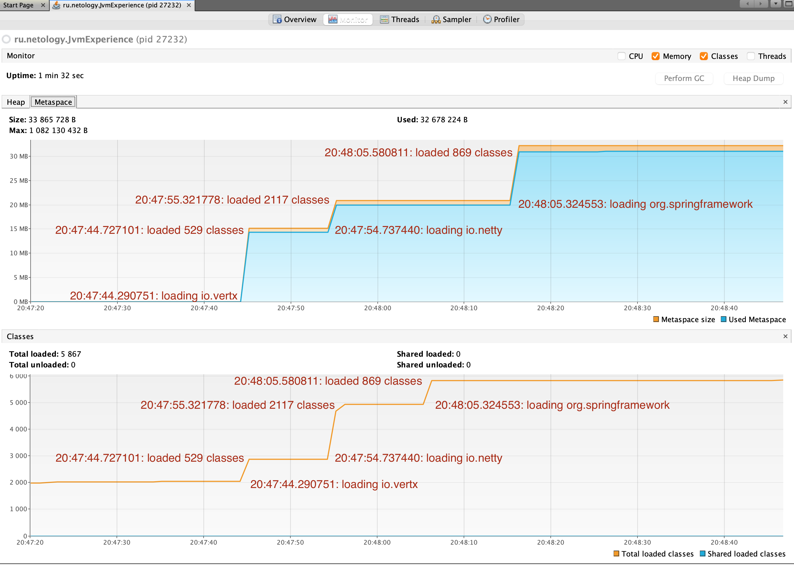
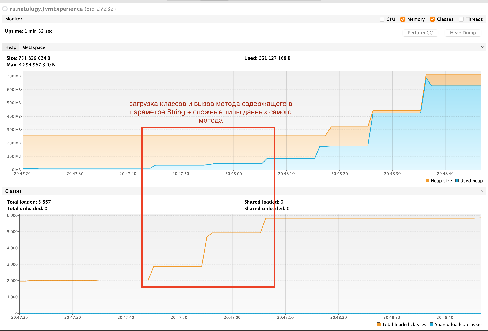
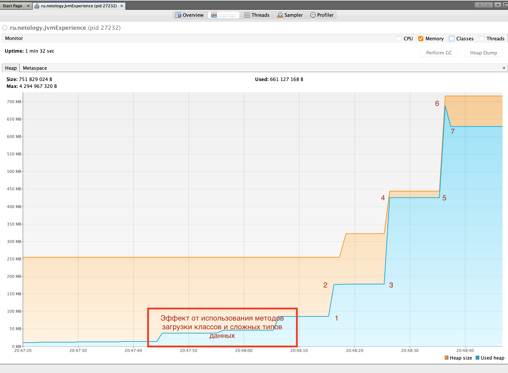

Домашнее задание для Netology.ru для курса Java Developer   

Описание и инструкция к выполнению [здесь](https://github.com/netology-code/jd-homeworks/tree/master/jvm/README.md)
___

### Классы в MetaSpace, увлеичение Heap при загрузке классов

Вызов метода загрузки классов а также используемые сложные типы данных рождают увеличение размера Heap (Сам же вызов метода увеличивает размер Stack, новые кадры в Stack)

### Heap при создании объектов

	1. 20:48:15.582193: creating 5000000 objects. 
	2. 20:48:15.719300: created. 
	3. 20:48:25.719988: creating 5000000 objects.  
	4. 20:48:25.982682: created. 
	5. 20:48:36.047494: creating 5000000 objects. 
	6. 20:48:36.285394: created , так же в этот момент работает сборщик мусора и отчищает Heap. 
	7. Сборщике мусора завершает отчистку Heap. 